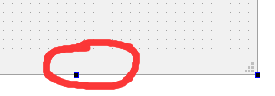
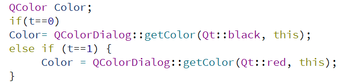

# My Reminder_Note Project Report
This is my final qt project, I thought for a long time before I chose to do this project.And my software may still have some problems, please don't mind.  

## My project description.
It's a sticky note with encryption and reminder. It has a simple ui and easy to use. The user can set or change passwords for notes and he can also set a timed reminder which are really helpful.  
There is a rich text editing function in this note(change color,underline,bold, and italic).

### The main ui about my Reminder_Note:  
 
 
 

## About project design and its implementation.
* All the ui I designed in Designer, and the logical processing part of the software is written in the constructor of the class or the corresponding slot function.  
* The passport funtion is achieved by comparing Qtextedit the login interface with the text of the database.And the change passport funtion is just to change the text in the database.  
* In order to achieve local storage and encryption of notes, I use the QDatabase, QSqlite, and the QSqlquery to implement database functions.  
* The note text funtion is mainly based on QTabWidget.I add a QTextedit to every tab in QTabwidget to implement the record text funtion.Add and remove function is just to add and remove tab in QTabwidget.  
* The note text edit funtion is based on QTextCharFormat class, all the toolbuttons have the corresponding QTextCharFormat object in their slot funtion.  
* The remind funtion I first use a QDialog to set the time, and then I use the QTimer to record the time. The timeout() signal is connected to the slot funtion which shows the remind dialog.  
* The About Designer QAction I have used many times, but this time I add a Qpushbutton to the dialog which can jump to my github homepage when it's clicked.  

## The problems I meet and solve.
1. There is a blank in the lower part of Qmainwindow, where I cannot place widgets.  
Reason:There is a centralWidget in the mainwindow,When the centralwidget is smaller than the mainwindow, the bottom blank will appear.  
  
Solve:Give centralwidget a bigger size.And hide the statubar.  

2. Chinese can not display properly
Solve:Use the funtion QStringLiteral.  

3. The select function does't work in Qsqlquery.(QSqlQuery::value: not positioned on a valid record)  
Solve:I should use the next() or first() function to move the record.  

4. The insert funtion and the update function sometimes don't work.  
Solve:The sqlite syntax is very strict and cannot have extra spaces in the string.  
5. I don't know how to change the selected text format in textedit(change color,underline,bold, and italic).  
Implementation:Use the QTextCharFormat class to set the format.  
    
6. How to delete the note which user has selected.  
Implementation:Add an int member variable to the class. When the tab is clicked, the value of this variable is assigned to the tab index. Each time the user delete it, the tab corresponding to the variable is deleted.  
  
7. Resume records each time the user opens the note.
Implementation:Read the last saved data information in the local database in the constructor of the class, and then add these loops in the same way as adding a new tab.  
  

## Some important technical details.
1. The use of Qt Resource file.  
Implementation:Add a new class named Qt resource file. Then add your files into the folder. When you want to use some files, you can just only by using :/name or just add the file in the Designer interface.  
  
2. Add the background picture to every window or dialog.  
Implementation:Add a label as large as the window and add an image to the label.  
3. Use qss to make tabwidget and toolbutton more beautiful.  
  
4. Click the button and jump to a webpage.
Implementation:Add the openurl function in the button clicked slot function.  

5. Add a menu to the Qtoolbutton and show a Qcolordialog when the qaction is triggered.  
Implementation:Add the qaction to the qmenu and then add the qmenu to the qtoolbutton;Just use the QColorDialog.  
  
  
  
6. Create a new note when the "new" button is clicked.
Implementation:Add a Qwidget, then add a qtextedit with this Qwidget as the parent class. Set qtextedit to the same size as tabwidget. Finally add qwidget to qtabwidget.  
  
7. About setting timed reminders.
Implementation:Add a Qtimer variable to the class member (not destroyed at the end of the slot function), set a dialog in the slot function and return the set value, then use the toint() function to convert it to an int variable. Use this variable to start the Qtimer object.Finally show reminder box in timeout slot function and close qtimer.  
 
8. Judge the passport.
Implemetation:Use qsqlquery to read the contents of the database and compare it with the value of the qstring type returned by the dialog. Use qmessagebox to prompt login success or failure.  
  

## Reference
* About the login dialog and its handling
  >[QT读写Sqlite数据库](https://blog.csdn.net/lms1008611/article/details/81271712)  
  >[在Qt中使用SQLite数据库](https://www.cnblogs.com/xia-weiwen/archive/2017/05/04/6806709.html)    
  >[Qmessagebox](https://www.cnblogs.com/Peit/p/7493689.html)  
  >[实现QDialog的exec()方法](https://blog.csdn.net/goforwardtostep/article/details/53667566)  

* About the note basic function
  >[The Style Sheet Syntax](https://doc.qt.io/Qt-5/stylesheet-syntax.html)
  >[QToolbutton样式](https://blog.csdn.net/liqingjielihanjie/article/details/83547208)  
  >[Qt 文本框类QLineEdit和QTextEdit](https://blog.csdn.net/sz76211822/article/details/72901645)  
  >[QTabwidget删除tab](http://www.qtcn.org/bbs/simple/?t48871.html)  
  >[QT中QString 类的使用](https://blog.csdn.net/haiross/article/details/49861823)  
  >[QTextEdit使用](https://blog.csdn.net/ac_huang/article/details/23833127)  
  >[QString与int值互相转换](https://blog.csdn.net/qq_37874258/article/details/79711323)  
  
  
* About the remind funtion
  >[qt对话框关闭以及自动释放内存](https://blog.csdn.net/swartz_lubel/article/details/55522696)  
  >[QTimer的使用](https://www.cnblogs.com/wurenzhong/p/7900912.html)  

* About Qt operations and other aspects
  >[阿里矢量图库](https://www.iconfont.cn/)  
  >[QDesktopServices Class](https://doc.qt.io/archives/qt-4.8/qdesktopservices.html)  
  >[按钮添加图片](https://blog.csdn.net/qq_38313246/article/details/81866604)  
